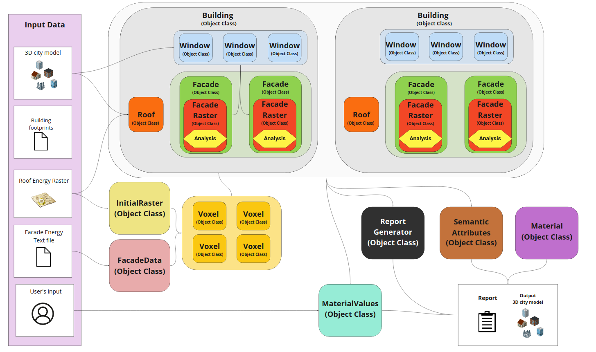

# Daylight Estimation Tool
A repo created for all the software development that will be used for the thesis project

**Virtual Environment** 

It is very recommended to run all modules in a virtual environment.

Linux users can use these command to create one:

```sudo apt install python3-venv```

```python3 -m venv <project_virtual_environment>```

```source <project_virtual_environment>/bin/activate ```

Requirements can be installed by command:

```pip3 install -r requirements.txt ```

Windows users can easily create virtual environment inside free IDE Pycharm, which also automatically installs the requirements.

Or follow some manuals on Internet. For example, here:
https://medium.com/analytics-vidhya/virtual-environment-6ad5d9b6af59


**Modules**

*Pre-processor*
 
Creates required input data for the UMEP Modeling Tool.

The tool does following:
* extracts height of the buildings from a city model stored in CityJSON format
* updates shapefile that is required for the creation of DSM within the UMEP Modeling Tool

Usage of the tool is as following:
```preprocessor.py <path_to_cityJSON_input_file>.json <path_to_output_shapefile>.shp```

To perform a solar energy simulation with UMEP (a required input), please follow the instructions on this website:
https://umep-docs.readthedocs.io/en/latest/


*DET Tool (daylight estimation tool)*

Estimates the solar irradiance values on window features.

The architecture of the tool can be seen on the picture bellow:


The configuration is set to test dataset stored in the data repository.
Change configuration in respect to your own data.

You can launch the tool by this command:

```python3 det.py ```

Follow instructions in the CLI and the tool will create the outputs based on the configuration file.


More details about the entire project can be found in:
Nezval, P. 2021. Design, implementation, and evaluation of a daylight estimation tool using 3D city model data. Lund University (Master Thesis)
